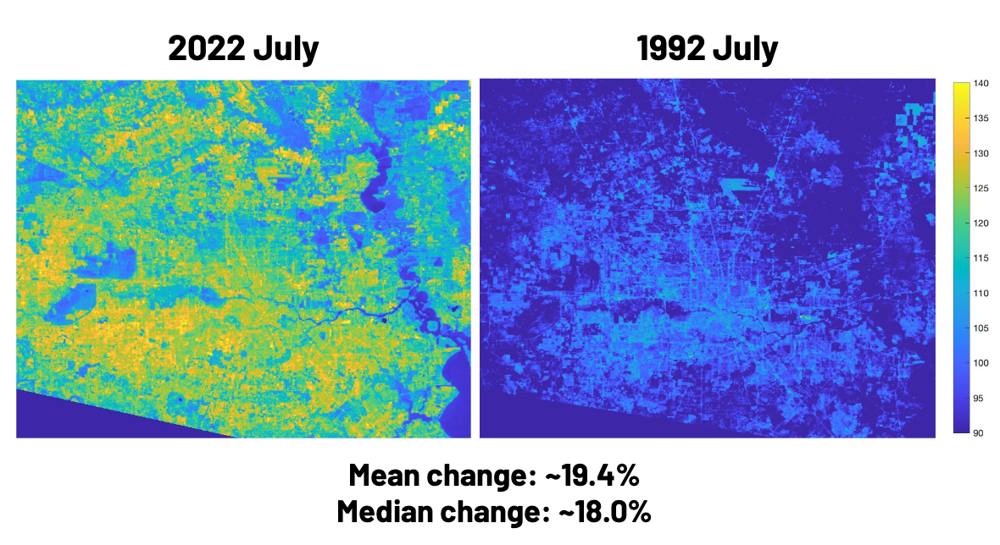

<nav style="text-align: center;">
  <a href="/" style="margin-right: 20px;">Home</a>
  <a href="/about" style="margin-right: 20px;">About</a>
  <a href="/projects">Projects</a>
</nav>

---

# GIS

### Barhopping with Santa Claus
A geographical analysis of holiday bars in San Francisco -> We found the best route for Santa Claus to barhop.

### Induced Demand
See <[Induced Demand Repo](https://github.com/joeltam/induced_demand)>

### Impact of Urban Sprawl on the Heat Island Effect
Processed Landsat 8 satellite data through QGIS and MATLAB for composite true color imaging and thermal imaging, respectively.
Findings @ Houston, TX:
Surface temperatures from July 1992 increased by 18.0% by July 2022. From October 1992 to October 2022, temperatures increased by 2.4%. Summers in Houston are getting warmer.

In 2022, July was warmer than October by 21.1%.
In 1992, July was warmer than October by 9.1%.

<!--  -->

  

